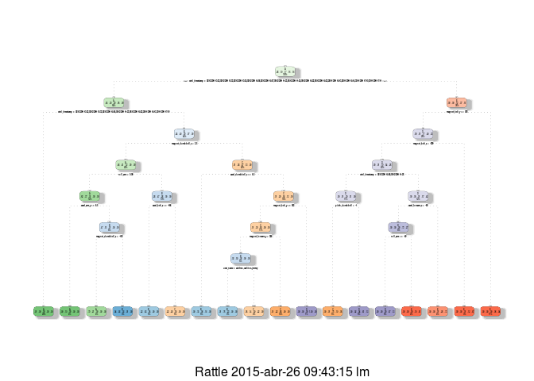

# Practical Machine Learning Course Project
by emark  
`r format(Sys.Date(), '%d/%m/%Y')`  

## Project Overview
Using devices such as Jawbone Up, Nike FuelBand, and Fitbit it is now possible to collect a large amount of data about personal activity relatively inexpensively. These type of devices are part of the quantified self movement – a group of enthusiasts who take measurements about themselves regularly to improve their health, to find patterns in their behavior, or because they are tech geeks. One thing that people regularly do is quantify how much of a particular activity they do, but they rarely quantify how well they do it. In this project, your goal will be to use data from accelerometers on the belt, forearm, arm, and dumbell of 6 participants. They were asked to perform barbell lifts correctly and incorrectly in 5 different ways.  

### Goal   
Predict the manner in which people did the exercise.  
  
## Data Source
[Training data](https://d396qusza40orc.cloudfront.net/predmachlearn/pml-training.csv)  
[Testing data](https://d396qusza40orc.cloudfront.net/predmachlearn/pml-testing.csv)

## Data Preparation

Loadind packages

```r
library(reshape2)
library(caret)
```

```
## Loading required package: lattice
## Loading required package: ggplot2
```

```r
library(rpart)
library(randomForest)
```

```
## randomForest 4.6-10
## Type rfNews() to see new features/changes/bug fixes.
```

```r
library(rattle)
```

```
## Rattle: A free graphical interface for data mining with R.
## Version 3.4.1 Copyright (c) 2006-2014 Togaware Pty Ltd.
## Type 'rattle()' to shake, rattle, and roll your data.
```

Loading the data.

```r
urlTrain <- "https://d396qusza40orc.cloudfront.net/predmachlearn/pml-training.csv"
urlTest <- "https://d396qusza40orc.cloudfront.net/predmachlearn/pml-testing.csv"
dirData <- "Data/"
fileTrain <- paste0(dirData, "train.csv")
fileTest <- paste0(dirData, "test.csv")
if (!file.exists(dirData)) {
    dir.create(dirData)
}    
if (!file.exists(fileTrain)) {
    download.file(urlTrain, fileTrain, method="curl")
}
if (!file.exists(fileTest)) {
    download.file(urlTest, fileTest, method="curl")
}
dfTrainSource <- read.csv(fileTrain, na.strings=c("", "NA", "#DIV/0!"))
dfTestSource <- read.csv(fileTest, na.strings=c("", "NA", "#DIV/0!"))
dim(dfTrainSource); dim(dfTestSource)
```

```
## [1] 19622   160
```

```
## [1]  20 160
```

### Splitting data for cross validation 
60% for training and 40% for testing

```r
set.seed(1245)
inTrain <- createDataPartition(dfTrainSource$classe, p=0.6, list=FALSE)
dfTrain <- dfTrainSource[inTrain, ]
dfTest <- dfTrainSource[-inTrain, ]
dim(dfTrain); dim(dfTest)
```

```
## [1] 11776   160
```

```
## [1] 7846  160
```

### Exploring training dataset and selecting predictors
1. Removing counter variable

```r
dfTrain <-  subset(dfTrain, select=-X)
```

2. % of NA values in each variable.  
Calculating.  

```r
sumNACols <- sapply(dfTrain, function(x){sum(is.na(x))})
percNACols <- round((sumNACols/nrow(dfTrain))*100, 2)
percNAColsSelected <- percNACols[percNACols>0]
summary(percNAColsSelected)
```

```
##    Min. 1st Qu.  Median    Mean 3rd Qu.    Max. 
##   97.97   97.97   97.97   98.14   98.00  100.00
```
See complete list of variables with % of NA values > 0% in Appendix 1.  
  
Removing variable with % of NA >= 90.

```r
colsNNA <- percNACols < 90
dfTrain <-  subset(dfTrain, select=colsNNA)
```
  
3. Correlation of *classe* variable with other variables.  
Calculating correlation.

```r
# Transforming classe to integer
iclasse <- 
    ifelse(dfTrain$classe=="A", 1, 
    ifelse(dfTrain$classe=="B", 2,  
    ifelse(dfTrain$classe=="C", 3, 
    ifelse(dfTrain$classe=="D", 4,
    ifelse(dfTrain$classe=="E", 5, NA
    )))))
# Making dataset with numeric data only
classCols <- sapply(dfTrain, class)
colsNumeric <-  classCols=="numeric"|classCols=="integer"
dfTrainNum <- subset(dfTrain, select=colsNumeric)
# Calculating correlation
corClasse <- cor(iclasse, dfTrainNum)
names(corClasse) <- names(dfTrainNum)
corClasse <- corClasse[1, ]
corClasseSoted <- sort(abs(corClasse))
summary(corClasseSoted)
```

```
##      Min.   1st Qu.    Median      Mean   3rd Qu.      Max. 
## 0.0006317 0.0168900 0.0477400 0.0769100 0.1107000 0.3362000
```
See complete list of correlation in Appendix 2.  
  
Removing columns with low and NA correlation (keeping all non-numeric columns and numeric columns with correlation > mean). 

```r
colsRemove <- c(
    names(corClasseSoted[corClasseSoted<=mean(corClasseSoted)]), # columns with correlation <= mean
    names(corClasse[is.na(corClasse)]) # columns with NA correlation
)
dfTrainPrepared <- dfTrain[, !names(dfTrain) %in% colsRemove]
```

### Preparing Testing dataset

```r
# Making the list of predictors
colPredictors <- names(dfTrainPrepared)
# Removing classe variable from predictors
colPredictors <- colPredictors[colPredictors!="classe"]
# Selecting predictor variables from source testing dataset
dfTestPrepared <- dfTest[, colPredictors]
```
  
  
## Prediction
### Choosing a model
To choose a model we will fit models using Tree and Random Forest algorithms based on prepared training dataset. Then we will make cross validation for each model - predict *classe* based on testing dataset and compare results with actual *classe* values.  
  
1. Tree

```r
# Fitting a model
modTree <- rpart(classe ~ ., data=dfTrainPrepared, method="class") # classe is a factor, so method = "class"
# Predicting 
predTree <- predict(modTree, newdata=dfTestPrepared, type="class")
# Comparing predicted and actual values
cmTree <- confusionMatrix(predTree, dfTest$classe)
cmTree$overall[1]
```

```
##  Accuracy 
## 0.7925057
```

```r
cmTree$table
```

```
##           Reference
## Prediction    A    B    C    D    E
##          A 1989  259    0    0    0
##          B  151  854  118   55    0
##          C   92  395 1205  170   20
##          D    0   10   39  882  134
##          E    0    0    6  179 1288
```
See Tree model plot in Appendix 3. 

2. Random Forest

```r
# Fitting a model
set.seed(825)
modRF <- randomForest(classe ~ ., data=dfTrainPrepared) 
# Predicting 
predRF <- predict(modRF, newdata=dfTestPrepared, type="class")
# Comparing predicted and actual values
cmRF <- confusionMatrix(predRF, dfTest$classe)
cmRF$overall[1]
```

```
##  Accuracy 
## 0.9751466
```

```r
cmRF$table
```

```
##           Reference
## Prediction    A    B    C    D    E
##          A 2211   34    0    0    0
##          B   14 1463   26    3    0
##          C    7   20 1334   48    0
##          D    0    1    8 1231   30
##          E    0    0    0    4 1412
```
  
Accurancy of the Random Forest model (0.97515) is higher than of the Tree model (0.79251), so we will use Random Forest model for prediction.

## Predicting
Preparing source Testing data.

```r
# selecting predictors
dfTestSourcePrepared <- dfTestSource[, colPredictors]
# Checking data type
dfTestSourcePrepared$magnet_dumbbell_z <- as.numeric(dfTestSourcePrepared$magnet_dumbbell_z)
dfTestSourcePrepared$magnet_forearm_y <- as.numeric(dfTestSourcePrepared$magnet_forearm_y)
# Setting factor levels
levels(dfTestSourcePrepared$user_name) <- levels(dfTrainPrepared$user_name)
levels(dfTestSourcePrepared$cvtd_timestamp) <- levels(dfTrainPrepared$cvtd_timestamp)
levels(dfTestSourcePrepared$new_window) <- levels(dfTrainPrepared$new_window)
```
Predicting on the source Testing data. 

```r
predFinal <- predict(modRF, newdata=dfTestSourcePrepared, type="class")
```
Save predicted Values. 

```r
dirRes <- "Results/"
if (!file.exists(dirRes)) {
    dir.create(dirRes)
} 
sapply(1:length(predFinal), 
    function(i){
        write.table(predFinal[i], paste0(dirRes, "problem_id_", i, ".txt"), quote = FALSE, row.names = FALSE, col.names = FALSE)
    }
)
```
     
## Appendices
### Appendix 1
List of variables in Training dataset with % of NA values > 0%.

```r
melt(sort(percNAColsSelected))
```

```
##                           value
## max_roll_belt             97.97
## max_picth_belt            97.97
## min_roll_belt             97.97
## min_pitch_belt            97.97
## amplitude_roll_belt       97.97
## amplitude_pitch_belt      97.97
## var_total_accel_belt      97.97
## avg_roll_belt             97.97
## stddev_roll_belt          97.97
## var_roll_belt             97.97
## avg_pitch_belt            97.97
## stddev_pitch_belt         97.97
## var_pitch_belt            97.97
## avg_yaw_belt              97.97
## stddev_yaw_belt           97.97
## var_yaw_belt              97.97
## var_accel_arm             97.97
## avg_roll_arm              97.97
## stddev_roll_arm           97.97
## var_roll_arm              97.97
## avg_pitch_arm             97.97
## stddev_pitch_arm          97.97
## var_pitch_arm             97.97
## avg_yaw_arm               97.97
## stddev_yaw_arm            97.97
## var_yaw_arm               97.97
## max_roll_arm              97.97
## max_picth_arm             97.97
## max_yaw_arm               97.97
## min_roll_arm              97.97
## min_pitch_arm             97.97
## min_yaw_arm               97.97
## amplitude_roll_arm        97.97
## amplitude_pitch_arm       97.97
## amplitude_yaw_arm         97.97
## skewness_pitch_dumbbell   97.97
## max_roll_dumbbell         97.97
## max_picth_dumbbell        97.97
## min_roll_dumbbell         97.97
## min_pitch_dumbbell        97.97
## amplitude_roll_dumbbell   97.97
## amplitude_pitch_dumbbell  97.97
## var_accel_dumbbell        97.97
## avg_roll_dumbbell         97.97
## stddev_roll_dumbbell      97.97
## var_roll_dumbbell         97.97
## avg_pitch_dumbbell        97.97
## stddev_pitch_dumbbell     97.97
## var_pitch_dumbbell        97.97
## avg_yaw_dumbbell          97.97
## stddev_yaw_dumbbell       97.97
## var_yaw_dumbbell          97.97
## max_roll_forearm          97.97
## max_picth_forearm         97.97
## min_roll_forearm          97.97
## min_pitch_forearm         97.97
## amplitude_roll_forearm    97.97
## amplitude_pitch_forearm   97.97
## var_accel_forearm         97.97
## avg_roll_forearm          97.97
## stddev_roll_forearm       97.97
## var_roll_forearm          97.97
## avg_pitch_forearm         97.97
## stddev_pitch_forearm      97.97
## var_pitch_forearm         97.97
## avg_yaw_forearm           97.97
## stddev_yaw_forearm        97.97
## var_yaw_forearm           97.97
## kurtosis_picth_dumbbell   97.98
## skewness_roll_dumbbell    97.98
## kurtosis_roll_dumbbell    97.99
## max_yaw_dumbbell          97.99
## min_yaw_dumbbell          97.99
## amplitude_yaw_dumbbell    97.99
## kurtosis_roll_belt        98.00
## skewness_roll_belt        98.00
## max_yaw_belt              98.00
## min_yaw_belt              98.00
## amplitude_yaw_belt        98.00
## kurtosis_yaw_arm          98.03
## skewness_yaw_arm          98.03
## kurtosis_picth_belt       98.10
## skewness_roll_belt.1      98.10
## skewness_roll_arm         98.34
## kurtosis_roll_arm         98.35
## skewness_roll_forearm     98.35
## kurtosis_picth_arm        98.36
## skewness_pitch_arm        98.36
## kurtosis_roll_forearm     98.36
## max_yaw_forearm           98.36
## min_yaw_forearm           98.36
## amplitude_yaw_forearm     98.36
## kurtosis_picth_forearm    98.37
## skewness_pitch_forearm    98.37
## kurtosis_yaw_belt        100.00
## skewness_yaw_belt        100.00
## kurtosis_yaw_dumbbell    100.00
## skewness_yaw_dumbbell    100.00
## kurtosis_yaw_forearm     100.00
## skewness_yaw_forearm     100.00
```
  
### Appendix 2
Correlation of *classe* variable with other variables.

```r
melt(corClasseSoted)
```

```
##                             value
## gyros_forearm_y      0.0006317088
## accel_belt_y         0.0011966491
## magnet_dumbbell_y    0.0029751527
## gyros_arm_x          0.0033104299
## pitch_belt           0.0052379664
## accel_forearm_z      0.0061624195
## gyros_dumbbell_x     0.0070087810
## accel_belt_x         0.0123132651
## gyros_belt_z         0.0134443423
## gyros_forearm_z      0.0136666760
## raw_timestamp_part_2 0.0148087360
## yaw_dumbbell         0.0148217282
## gyros_belt_y         0.0154326141
## gyros_belt_x         0.0168767980
## accel_dumbbell_y     0.0168947539
## gyros_arm_z          0.0173975488
## gyros_dumbbell_z     0.0174358123
## gyros_arm_y          0.0174942472
## roll_forearm         0.0188458880
## raw_timestamp_part_1 0.0195797079
## yaw_belt             0.0200139192
## accel_forearm_y      0.0203060173
## gyros_forearm_x      0.0225523596
## magnet_belt_x        0.0225708314
## num_window           0.0227649756
## roll_dumbbell        0.0422056204
## magnet_forearm_z     0.0465658145
## accel_arm_z          0.0477368066
## gyros_dumbbell_y     0.0486361307
## yaw_forearm          0.0487721858
## yaw_arm              0.0500539363
## total_accel_dumbbell 0.0532933815
## magnet_dumbbell_x    0.0604447474
## roll_belt            0.0680884421
## accel_dumbbell_z     0.0725084966
## roll_arm             0.0798108127
## pitch_dumbbell       0.0799976912
## total_accel_belt     0.0823407213
## accel_belt_z         0.0852952855
## accel_arm_y          0.0913143883
## magnet_forearm_y     0.1072067278
## accel_dumbbell_x     0.1141888800
## total_accel_arm      0.1295014023
## magnet_arm_z         0.1462030937
## magnet_dumbbell_z    0.1510810837
## total_accel_forearm  0.1572637318
## magnet_forearm_x     0.1714320775
## pitch_arm            0.1824124895
## magnet_belt_z        0.1826283095
## accel_forearm_x      0.1831267660
## accel_arm_x          0.2355228516
## magnet_arm_y         0.2541191745
## magnet_belt_y        0.2875374777
## magnet_arm_x         0.2906236883
## pitch_forearm        0.3361682855
```

### Appendix 3
Tree model plot.

```r
fancyRpartPlot(modTree)
```

 
